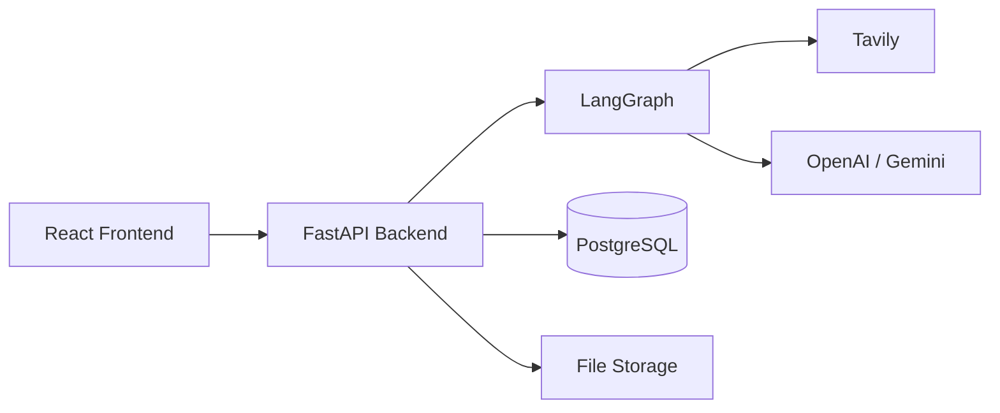
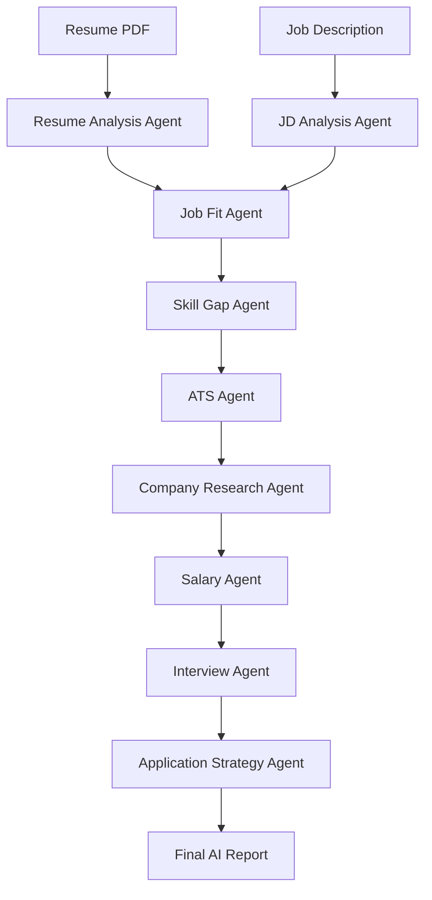
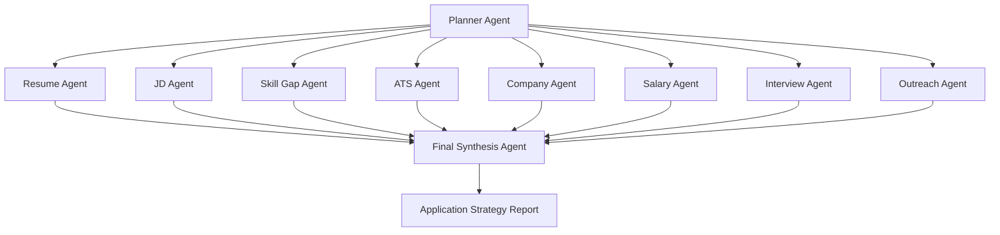

# AI Career Copilot

# AI Career Copilot

AI Career Copilot is a multi-agent AI platform that helps job seekers make better application decisions before they apply.

Instead of manually researching companies, analyzing job descriptions, identifying skill gaps, optimizing resumes, preparing for interviews, and drafting outreach messages, users receive a comprehensive AI-generated application strategy report within minutes.

---

## Features

- Resume parsing using Gemini
- Resume analysis against job descriptions
- Company intelligence using Tavily
- Skill gap analysis
- AI-powered match scoring
- Structured report generation
- LangGraph-based workflow orchestration
- Background processing with Redis
- PostgreSQL persistence

---

## High Level Architecture


## AI Workflow


## LangGraph Agent Architecture



## Tech Stack

### Backend

- FastAPI
- PostgreSQL
- SQLAlchemy
- Alembic

### AI

- LangGraph
- OpenAI
- Gemini
- Claude

### Search

- Tavily

### Infrastructure

- Docker

---

## Installation

### Clone the repository

```bash
git clone https://github.com/Sonalanand102/ai-career-copilot-backend.git

cd ai-career-copilot-backend
```

### Create a virtual environment

```bash
python -m venv venv

source venv/bin/activate
```

### Install dependencies

```bash
pip install -r requirements.txt
```
---

## Environment Variables

Create a `.env` file.

```env
DATABASE_URL=

REDIS_URL=

GEMINI_API_KEY=

TAVILY_API_KEY=
```

---

## Running the Project

### Start infrastructure

```bash
docker compose up -d
```

### Run database migrations

```bash
alembic upgrade head
```

### Start FastAPI

```bash
uvicorn app.main:app --reload
```

### Start the background worker

```bash
python -m app.workers.resume_worker
```

---

## API Documentation

Swagger UI

```text
http://localhost:8000/docs
```
---

## Why I Built This

Traditional job search relies heavily on keywords and manual effort.

Candidates often spend hours:

- Understanding job requirements
- Researching companies
- Comparing their profile with the role
- Identifying missing skills
- Optimizing resumes
- Preparing for interviews

Despite this effort, many applications still fail due to poor role fit, ATS incompatibility, or lack of preparation.

AI Career Copilot was built to automate this entire decision-making process using AI agents.

---

## What Makes This Different

Most AI career tools focus on a single problem:

- Resume review
- ATS scoring
- Cover letter generation
- Interview preparation

AI Career Copilot combines all of these into a single workflow and generates a personalized application strategy.

The goal is not just to help users apply.

The goal is to help users decide whether they should apply in the first place.

---

## Core Workflow

```text
Resume
   +
Job Description
   ↓

Resume Analysis
   ↓

Job Analysis
   ↓

Job Fit Analysis
   ↓

Skill Gap Detection
   ↓

ATS Evaluation
   ↓

Company Research
   ↓

Salary Intelligence
   ↓

Interview Preparation
   ↓

Application Strategy
   ↓

Final AI Report
```

---

## Architecture

The platform follows a multi-agent architecture built with LangGraph.

```text
Planner Agent

├── Resume Agent
├── JD Agent
├── ATS Agent
├── Skill Gap Agent
├── Company Agent
├── Salary Agent
├── Interview Agent
├── Outreach Agent

↓

Final Synthesis Agent
```

Each agent is responsible for a specific domain and produces structured outputs that are combined into a final report.

---

## Key Outputs

The platform generates:

- Job Fit Score
- ATS Score
- Skill Gap Analysis
- Resume Improvement Suggestions
- Company Intelligence
- Salary Insights
- Interview Roadmap
- Cover Letter
- Recruiter Outreach Templates
- Personalized Application Strategy

---

## Project Status

Currently under active development.

The initial MVP focuses on building a production-ready AI workflow with structured outputs, persistent storage, and multi-agent orchestration.

---

## Long-Term Vision

I believe the future of job search is not about sending more applications.

It is about sending fewer, better applications.

AI Career Copilot aims to become an intelligent career companion that helps users make data-driven career decisions with confidence.
